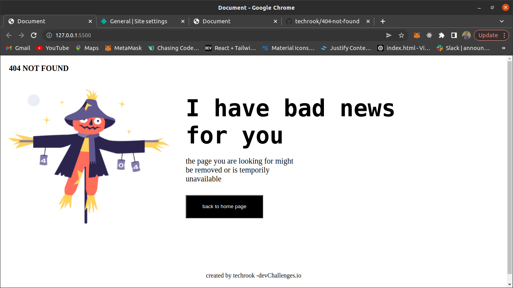

<!-- Please update value in the {}  -->

<h1 align="center">{404-not-found}</h1>

   Solution for a challenge from  <a href="http://devchallenges.io" target="_blank">Devchallenges.io</a>.

  <h3>
    <a href="https://err404page.netlify.app/">
      Demo
    </a>
     | 
    <a href="https://err404page.netlify.app/">
      Solution
    </a>
     | 
    <a href="https://devchallenges.io/challenges/wBunSb7FPrIepJZAg0sY">
      Challenge
    </a>
  </h3>

<!-- TABLE OF CONTENTS -->

## Table of Contents

- [Overview](#overview)
  - [Built With]
- [Features]
- [Contact]
- [Acknowledgements]

<!-- OVERVIEW -->

## Overview

Introduce your projects by taking a screenshot or a gif. Try to tell visitors a story about your project by answering:

- The 404 error project is a responsive error page inspired by devchallenge.io 
- It took me almost 48 hours to get it done , i used the sass for responsiveness. so its basicly a styling project
- my media query knowledge has improved , like wise my responsive design knowledge like mobile first design makes media query easier 

### Built With

<!-- This section should list any major frameworks that you built your project using. Here are a few examples.-->

- [HTML](https://developer.mozilla.org/en-US/docs/Learn/Getting_started_with_the_web/HTML_basics
- [SASS](https://sass-lang.com/)

## Features

<!-- List the features of your application or follow the template. Don't share the figma file here :) -->

This application/site was created as a submission to a [DevChallenges](https://devchallenges.io/challenges) challenge. The [challenge](https://devchallenges.io/challenges/wBunSb7FPrIepJZAg0sY) was to build an application to complete the given user stories.

## Acknowledgements

<!-- This section should list any articles or add-ons/plugins that helps you to complete the project. This is optional but it will help you in the future. For exmpale -->

- [Steps to replicate a design with only HTML and CSS](https://devchallenges-blogs.web.app/how-to-replicate-design/)

## Contact

- GitHub [@techrook](https://{github.com/techrook})
- Twitter [@itohowo23](https://{twitter.com/itohowo23})
